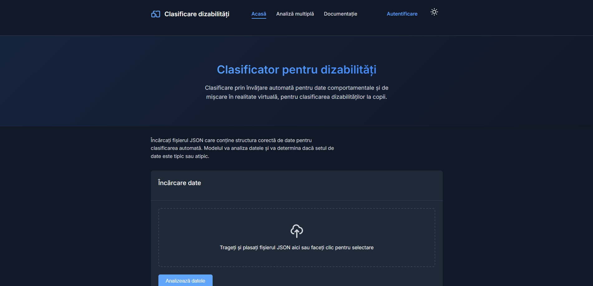
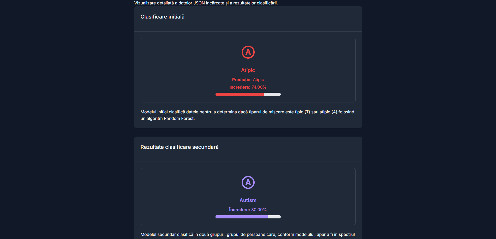
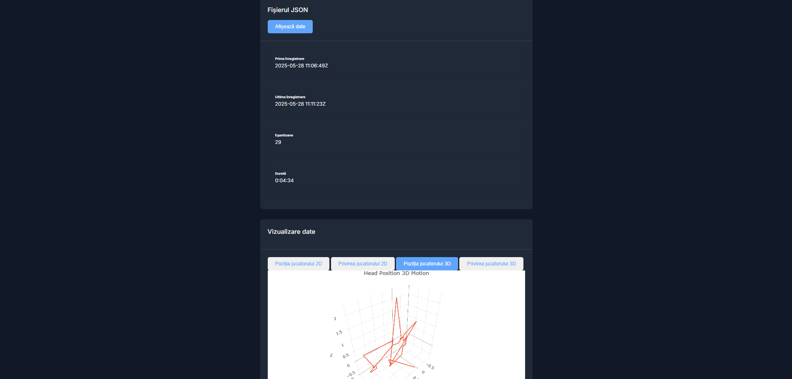

# VR Disability Classification Platform

## Web Application – Overview

This web application was developed as part of a Bachelor's degree project. It is designed to classify behavioral data of children with disabilities using two trained Random Forest classifiers. The models achieve over 80% accuracy in classifying data such as gaze, arm movement, and body position captured through various VR-based applications.

The primary goal of this application is to provide researchers and educators with a tool to analyze behavioral patterns in a controlled, VR-based environment. It allows for classification of typical and atypical behavior, and further categorization based on the type of disability.

**Important Notes:**

- The datasets used to train the models are **not publicly available** due to confidentiality and privacy concerns involving the participants.
- All VR session data handled by the application should be anonymized to protect user identities.
- The application is intended for **research and educational purposes only** and is not a clinical diagnostic tool.
- Users are encouraged to follow ethical guidelines when using and interpreting the classification results.

---

## Features

- Classify VR session data into **typical** and **atypical** behavior patterns
- Perform **secondary classification** for atypical cases based on disability type
- Upload and analyze **multiple VR sessions** in batch
- View historical classification results for authenticated users
- Explore and visualize behavioral data through the **Explore Data Page**

---

## Screenshots

1. **Main Page**  
   

2. **Classification Result Page**  
   

3. **Data Analysis Page**  
   

---

## JSON Input Requirements

The application accepts VR session data in JSON format. Below is a **trimmed example** showing the structure:

```json
[
  {
    "id": 0,
    "dateTime": "2025-05-28 10:52:27Z",
    "HeadPosition": { "x": 1.23, "y": 2.42, "z": -0.83 },
    "HeadRotation": { "x": 41.96, "y": 267.52, "z": 335.07 },
    "LeftHandPosition": { "x": 0.22, "y": 1.52, "z": -0.52 },
    "RightHandPosition": { "x": 1.51, "y": 1.93, "z": -1.25 }
  },
  {
    "id": 1,
    "dateTime": "2025-05-28 10:52:37Z",
    "HeadPosition": { "x": 1.42, "y": 0.32, "z": -1.32 },
    "HeadRotation": { "x": 34.72, "y": 284.75, "z": 354.87 },
    "LeftHandPosition": { "x": 0.22, "y": 1.2, "z": -0.52 },
    "RightHandPosition": { "x": 1.07, "y": 0.02, "z": -1.72 }
  }
]
```

_Note:_ All numerical values are floats representing positions, rotations, and directional vectors in 3D space.

---

## Technologies Used

- **Backend:** Django (Python)
- **Frontend:** Basic JavaScript for interactive elements
- **Machine Learning:** scikit-learn (Random Forest classifiers)

---

## Installation & User Guide

### Prerequisites

- Python 3.11.1 or a compatible version

---

## Installation and Setup

### Optional: Create a Virtual Environment

To keep project dependencies isolated, it is recommended to create a virtual environment:

python -m venv env

Activate the virtual environment:

- Windows:
  .\env\Scripts\activate

- macOS / Linux:
  source env/bin/activate

---

### Install Required Libraries

All necessary Python packages are listed in requirements.txt:

pip install -r requirements.txt

---

### Run the Django Server

After installing dependencies and setting up your virtual environment, navigate to the project directory.

If running the application for the first time, apply the database migrations:

```bash
python manage.py makemigrations
python manage.py migrate
```

Then start the server:

```bash
python manage.py runserver
```

The application will be available at: http://127.0.0.1:8000

## Using the Application

- The application can be used with or without a user account.

- On the main or multiple analysis pages, users can upload and classify JSON files obtained from VR sessions.

- Files classified as "atypical" have an additional section for data exploration and secondary classification based on disability type.

- Authenticated users will have access to the classified data in their history menu and can create unique sessions for further analysis.

---

## Future Work

- Improve model accuracy and expand training data with more VR session recordings
- Support additional behavioral features and sensors
- Implement real-time classification for live VR sessions
- Add richer visualizations and interactive analytics tools
- Provide an optional web-based deployment for wider access
- Explore integration with other machine learning models to enhance predictions
